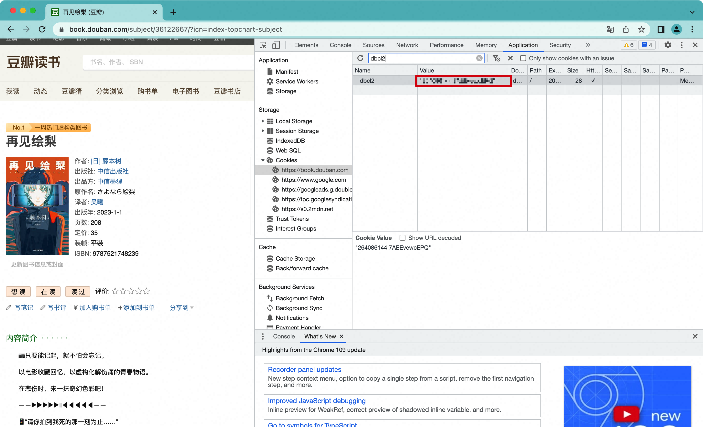

# mouban

> 截至 2023年4月，已汇总有效数据（去除了不存在的条目、被封禁条目后）：图书 371w 本、电影 31w 部、音乐 93w 首、游戏 2.8w 部。

本服务作为 [hexo-douban](https://github.com/mythsman/hexo-douban) 项目的后台数据获取服务，用于根据用户的豆瓣ID，获取用户在豆瓣的书、影、音、游中的标注信息，方便用户快速提取。

[](https://hub.docker.com/r/mythsman/mouban)

## 流程

简要的处理流程如下：

1. 用户输入个人豆瓣ID。
2. 访问读书首页获取用户头像、域名等信息。
3. 访问个人 rss 页面获得用户最新更新时间用于去重。
4. 访问用户书、影、音、游的首页获取总数等信息。
5. 滚动访问用户书、影、音、游的评论页获取评论信息、条目概览。
6. 访问条目详情页获取详细信息，并自动发现其他推荐的用户和条目。
7. 每天定时更新书、影、音、游的首页，获取最新条目。

## 部署

可以使用 docker-compose 进行快速部署，环境变量与 application.yml.sample 中的配置对应：

```yaml
    mouban:
      image: mythsman/mouban
      container_name: "mouban"
      restart: always
      expose:
        - "8080"
      environment:
        - GIN_MODE=release
        - agent__enable=true
        - agent__flow__discover=false
        - agent__discover__level=1
        - agent__item__concurrency=5
        - agent__item__max=10000
        - http__timeout=30000
        - http__retry_max=20
        - http__interval__user=5000
        - http__interval__item=2000
        - http__auth=11111:ABCDEFG,http://user:pass@ip:port;
        - server__cors=https://yourdomain.com
        - server__limit=30m
        - datasource__host=host for mysql
        - datasource__username=user name for mysql
        - datasource__password=passwd for mysql
```

其中最重要的是 http__auth 参数，用于配置登陆态的用户信息和走的http代理，格式为 `<dbcl2>,http://<user>:<password>@<proxyIp>:<proxyPort>;`
，可以配置多个。需要注意的是，豆瓣对于未登录的账号有概率会投毒（[例子](https://movie.douban.com/subject/4881682/)），所以这里采用登陆态账号来处理。

dbcl2需要在cookie中查看：


## 接口

以下为服务暴露的主要接口。线上已经部署了一套公共服务，域名使用 `https://mouban.mythsman.com/` 。

### 常用接口

#### 用户录入/更新

`http://localhost:8080/guest/check_user?id={your_douban_id}`

```json
{
  "result": {
    "id": 1000001,
    "domain": "ahbei",
    "name": "阿北",
    "thumbnail": "https://img1.doubanio.com/icon/u1000001-30.jpg",
    "book_wish": 81,
    "book_do": 61,
    "book_collect": 115,
    "game_wish": 1,
    "game_do": 0,
    "game_collect": 0,
    "movie_wish": 77,
    "movie_do": 17,
    "movie_collect": 218,
    "song_wish": 23,
    "song_do": 21,
    "song_collect": 24,
    "sync_at": 1667232000,
    "check_at": 1679646797,
    "publish_at": 1570409179
  },
  "success": true
}
```

其中：

* publish_at 表示用户最近一次更新的时间戳。
* check_at 表示最近一次**检测**用户是否有更新的时间戳。
* sync_at 表示最近一次**同步**用户信息的时间戳。

#### 查询用户的读书评论

`http://localhost:8080/guest/user_book?id={your_douban_id}&action=wish`

`http://localhost:8080/guest/user_book?id={your_douban_id}&action=do`

`http://localhost:8080/guest/user_book?id={your_douban_id}&action=collect`

#### 查询用户的电影评论

`http://localhost:8080/guest/user_movie?id={your_douban_id}&action=wish`

`http://localhost:8080/guest/user_movie?id={your_douban_id}&action=do`

`http://localhost:8080/guest/user_movie?id={your_douban_id}&action=collect`

#### 查询用户的游戏评论

`http://localhost:8080/guest/user_game?id={your_douban_id}&action=wish`

`http://localhost:8080/guest/user_game?id={your_douban_id}&action=do`

`http://localhost:8080/guest/user_game?id={your_douban_id}&action=collect`

#### 查询用户的音乐评论

`http://localhost:8080/guest/user_song?id={your_douban_id}&action=wish`

`http://localhost:8080/guest/user_song?id={your_douban_id}&action=do`

`http://localhost:8080/guest/user_song?id={your_douban_id}&action=collect`

### 后台接口

#### 加载 sitemap 数据

豆瓣在他的[robots.txt](https://www.douban.com/robots.txt)中分享了他的
sitemap，并且一直持续更新。因此我们可以通过 [sitemap_index](https://www.douban.com/sitemap_index.xml)
和 [sitemap_updated_index](https://www.douban.com/sitemap_updated_index.xml) 将存量数据离线下载下来，解压后按类型 grep
条目后直接一次性导入，节省了对存量数据的爬虫搜索逻辑。

加载离线 sitemap 数据。数据需要事先下载，并挂载到 docker 进程的指定路径下。

`http://localhost:8080/admin/load_data?path={path_to_local_sitemap_file}`

需要注意的是，sitemap 的数据并不全。除了举反例证明外，还有一个明显的例子，就是在 sitemap
中，书籍的条目数从 [五年前](https://www.zhihu.com/question/19583157/answer/140028235) 左右开始就是 3088633 条，但是最近一次更新时，发现 sitemap
中记录的书籍数还是这么多（即使 sitemap 本身也在更新）。因此增量更新始终是必要的。

#### 强制更新条目

目前条目下载好后，后续不会进行更新，如有更新需要，目前暂时需要手动强制更新一下。

item_type 取: 1-book 2-movie 3-game 4-song

`http://localhost:8080/admin/refresh_item?type={item_type}&id={item_douban_id}`

#### 强制更新用户

目前用户的评论信息更新下载好后，后续只会进行增量更新。如果对老的条目进行评论修改、删除等操作是不会同步更新的。

如有更新的要求，目前暂时需要手动强制更新一下。（谨慎使用，会对系统造成较大压力）

`http://localhost:8080/admin/refresh_user?id={douban_uid}`
