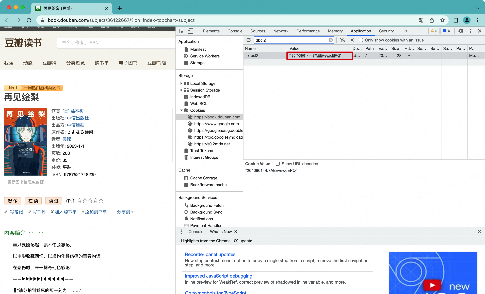

# mouban

> 截至 2025年06月，已汇总有效数据（去除了不存在的条目、被封禁条目后）：图书 447w 本、电影 48w 部、音乐 120w 首、游戏 3.8w 部。

本服务作为 [hexo-douban](https://github.com/mythsman/hexo-douban) 项目的后台数据获取服务，用于根据用户的豆瓣ID，获取用户在豆瓣的书、影、音、游中的标注信息，方便用户快速提取。

## 流程

简要的处理流程如下：

1. 用户输入个人豆瓣ID。
2. 访问读书首页获取用户头像、域名等信息。
3. 访问个人 rss 页面获得用户最新更新时间用于去重。
4. 访问用户书、影、音、游的首页获取总数等信息。
5. 滚动访问用户书、影、音、游的评论页获取评论信息、条目概览。
6. 访问条目详情页获取详细信息，并自动发现其他推荐的用户和条目。
7. 每天定时更新书、影、音、游的首页，获取最新条目。

## 部署

可以使用 docker-compose 进行快速部署，环境变量与 `.env.sample` 中的配置对应（全部采用 `MOUBAN_` 前缀 + 大写命名）：

```yaml
    mouban:
      image: mythsman/mouban
      container_name: "mouban"
      restart: always
      expose:
        - "8080"
      environment:
        - MOUBAN_AGENT_ENABLE=true
        - MOUBAN_AGENT_DISCOVER_LEVEL=1
        - MOUBAN_AGENT_ITEM_CONCURRENCY=5
        - MOUBAN_AGENT_ITEM_MAX=10000
        - MOUBAN_CRAWL_ENABLE=true
        - MOUBAN_STORAGE_ENABLE=true
        - MOUBAN_HTTP_TIMEOUT=30000
        - MOUBAN_HTTP_RETRY_MAX=20
        - MOUBAN_HTTP_INTERVAL_USER=5000
        - MOUBAN_HTTP_INTERVAL_ITEM=2000
        - MOUBAN_HTTP_AUTH=11111:ABCDEFG,http://user:pass@ip:port;
        - MOUBAN_USER_RECHECK_INTERVAL=30m
        - MOUBAN_SERVER_MODE=release
        - MOUBAN_DATASOURCE_HOST=host for mysql
        - MOUBAN_DATASOURCE_USERNAME=user name for mysql
        - MOUBAN_DATASOURCE_PASSWORD=passwd for mysql
```

其中最重要的是 `MOUBAN_HTTP_AUTH` 参数，用于配置登陆态的用户信息和走的http代理，格式为 `<dbcl2>,http://<user>:<password>@<proxyIp>:<proxyPort>;`
，可以配置多个。需要注意的是，豆瓣对于未登录的账号有概率会投毒（[例子](https://movie.douban.com/subject/4881682/)），所以这里采用登陆态账号来处理。

dbcl2需要在cookie中查看：


## 使用方式（推荐 Web 页面）

线上已经部署了一套可直接使用的 Web 页面，推荐通过页面完成全部查询与浏览。

入口：`https://mouban.mythsman.com/`

### 页面能力

- **用户查询**：支持通过 Douban UID / domain / 用户名精确匹配用户。
- **用户详情**：查看用户在书、影、游、音中的标注信息（想/在/过）。
- **条目详情**：查看条目元信息、评分分布、简介等内容。
- **调度队列**：查看当前抓取队列、运行任务与最近完成任务。
- **强制更新**：在用户详情与条目详情页，可通过页面按钮发起强制更新。

### 建议使用流程

1. 打开 Web 页面并搜索目标用户。
2. 进入用户详情，按媒体类型与标注状态筛选内容。
3. 点击条目进入详情页查看更多信息。
4. 如需排查抓取状态，进入「调度队列」页面。
5. 如需立即重新抓取，使用页面内的「强制更新」按钮。

> 说明：README 不再展示具体接口路径。若你是二次开发者，可在源码中查看路由与 controller 实现。
